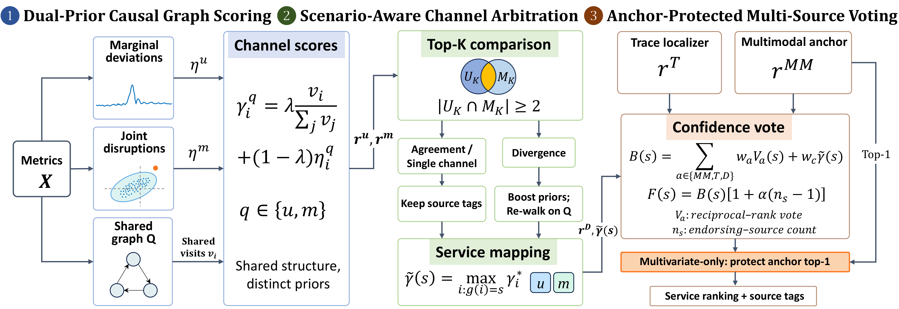
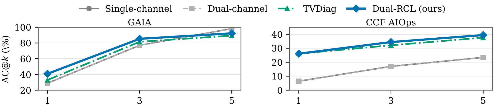

# Dual-RCL: Anchor-Guided Confidence Voting over Dual Causal and Diverse Evidence for Microservice Root Cause Localization

<p align="center">
  
  
  
  
</p>

Official PyTorch implementation of **Dual-RCL** (**Dual**-prior causal arbitration and anchor-protected voting for **R**oot **C**ause **L**ocalization), a source-aware root cause localization (RCL) framework for distributed microservice systems.

---

## 📖 Overview

Rapid **Root Cause Localization (RCL)** is critical for minimizing microservice downtime and Mean-Time-to-Repair (MTTR). However, cascading failure propagation across service dependencies frequently masks initiating root causes behind prominent downstream symptoms. Existing paradigms either infer metric causal graphs from single-metric tail spikes or condense multimodal telemetry into black-box service embeddings. Both suffer from **premature signal compression** and face three fundamental challenges:

- **#C1. Single-Prior Blind Spots:** Univariate detectors flag marginal spikes, whereas multivariate models capture disrupted inter-metric correlations. Relying on a single anomaly prior misses complementary fault modes, while inferring separate causal graphs per detector confounds prior differences with topology variance.
- **#C2. Score Attenuation Under Detector Disagreement:** Correlation-breaking faults trigger high multivariate reconstruction errors while single-metric scores remain near zero. Directly averaging both channels dilutes active anomaly signals and obscures whether the fault stems from a point spike or a correlation break.
- **#C3. Scale Mismatch and Cascading Symptom Bias Across Localizers:** Metric causal graphs, distributed trace localizers, and multimodal models produce raw scores on incompatible numerical scales. Moreover, as faults cascade along call paths, downstream symptom hubs exhibit simultaneous metric and trace anomalies, accumulating collinear votes that override the true upstream root cause.

To address these challenges, **Dual-RCL** delays evidence merging until each source produces an inspectable ranking, preserving diagnostic provenance and scenario tags across metric causal graphs, distributed traces, and multimodal localizers.

---

## 🏗️ Framework Architecture

<p align="center">
  
</p>

As illustrated above, **Dual-RCL** operates in three progressive stages:

1. **Stage 1 — Dual-Prior Causal Graph Scoring (`metric_anomaly.py`, `multivariate_anomaly.py`, `micro.py`):**
   - **Univariate Channel ($\boldsymbol{\eta}^u$):** Models marginal distribution tails via Extreme Value Analysis (SPOT) and classifies temporal anomaly shapes using a lightweight 1D-CNN into interpretable patterns (e.g., transient spikes, level shifts, trends).
   - **Multivariate Channel ($\boldsymbol{\eta}^m$):** Jointly reconstructs multi-metric time series (via **TranAD** by default, or configurable backbones such as USAD, OmniAnomaly, GDN, MTAD-GAT) and calibrates cumulative reconstruction errors to the univariate scale.
   - **Shared Metric Causal Graph ($Q$):** Infers a lagged directed causal graph $\mathcal{G}=(\mathcal{V},\mathcal{E})$ via the Peter-Clark (PC) algorithm and projects both $\boldsymbol{\eta}^u$ and $\boldsymbol{\eta}^m$ onto a **shared structural Markov transition kernel** $Q$ via cause-oriented random walks, isolating prior differences from topological variance.

2. **Stage 2 — Scenario-Aware Channel Arbitration (`anomaly_conflict_resolver.py`):**
   - Compares top-$K$ candidate sets ($U_K, M_K$) from the univariate and multivariate causal walks and categorizes each incident into one of four diagnostic regimes:
     - **Consistent (`|U_K ∩ M_K| ≥ 2`):** Preserves ranking order and records cross-channel endorsements.
     - **Multivariate-Only:** Retains the correlation-disruption ranking as primary evidence without penalizing absent marginal spikes.
     - **Univariate-Only:** Retains explicit marginal tail deviations while noting the unbacked correlation state.
     - **Divergent Roots:** Blends priors with an overlap boost vector and re-executes the random walk on the shared kernel $Q$.
   - Max-aggregates arbitrated metric scores per service to produce a unified metric ranking $\mathbf{r}^D$ ($\widetilde{\gamma}$) annotated with scenario tags.

3. **Stage 3 — Anchor-Protected Multi-Source Voting (`failure_localization/`, `mepfl.py`, `run.py`):**
   - Converts the multimodal anchor ranking ($\mathbf{r}^{MM}$), distributed trace ranking ($\mathbf{r}^T$), and unified metric causal ranking ($\mathbf{r}^D$) into scale-free **Reciprocal Rank Fusion (RRF)** votes reinforced by a cross-source consensus bonus.
   - Applies **Multivariate-Only Top-1 Protection** (topology-informed collinearity suppression): under correlation-only disruptions, confirmation sources reorder candidates below rank 1 (`#2–#5`) to expand recall while structurally protecting the top-1 anchor candidate against downstream symptom-hub overrides.
   - _(Downstream Explanation Formatter)_: An offline LLM formatter consumes the final ranked services and preserved scenario/provenance tags to generate human-readable incident triage reports for SRE operators without altering algorithmic rankings.

---

## 📊 Main Experimental Results

**Dual-RCL** is evaluated on two public microservice benchmarks—**GAIA** (in-distribution deployment) and **CCF AIOps** (cross-cluster deployment shift)—achieving state-of-the-art top-rank accuracy (`40.8%` AC@1 and `85.3%` AC@3 on GAIA) while preserving peak top-1 precision (`26.1%` AC@1) and expanding top-$k$ recall (`34.4%` AC@3, `39.4%` AC@5) under cross-cluster shifts.

<p align="center">
  
</p>

| Benchmark     | Method              | Paradigm                                        | AC@1 (%) | AC@3 (%) | AC@5 (%) | Avg@5 (%) |
| :------------ | :------------------ | :---------------------------------------------- | :------: | :------: | :------: | :-------: |
| **GAIA**      | LocaleXpert         | Univariate Causal + Trace                       |   29.0   |   78.2   |   88.7   |   65.3    |
| **GAIA**      | DualChannel         | Dual-Prior Causal Arbitration                   |   31.5   |   81.5   |   91.1   |   68.0    |
| **GAIA**      | TVDiag              | Multimodal GNN (Metric + Trace + Log)           |   32.9   |   81.5   | **98.4** |   70.9    |
| **GAIA**      | **Dual-RCL (Ours)** | **Dual-Prior Causal + Anchor-Protected Voting** | **40.8** | **85.3** |   92.3   | **72.8**  |
| **CCF AIOps** | LocaleXpert         | Univariate Causal + Trace                       |   20.6   |   24.3   |   27.1   |   24.0    |
| **CCF AIOps** | DualChannel         | Dual-Prior Causal Arbitration                   |   22.2   |   25.2   |   28.0   |   25.1    |
| **CCF AIOps** | TVDiag              | Multimodal GNN (Metric + Trace + Log)           | **26.1** |   32.1   |   37.6   |   31.9    |
| **CCF AIOps** | **Dual-RCL (Ours)** | **Dual-Prior Causal + Anchor-Protected Voting** | **26.1** | **34.4** | **39.4** | **33.3**  |

---

## 📂 Repository Structure

```text
Dual-RCA/
├── assets/                           # Framework diagrams and result figures
│   ├── fig_framework.png             # Overview of the 3-stage Dual-RCL architecture
│   ├── fig_motivating_example.png    # Motivating example of connection-pool exhaustion
│   └── fig_main_results_topk_curve.png
├── anomaly_detection/                # Stage 1: Configurable multivariate anomaly detection package
│   ├── __init__.py                   # Package entrypoint (create_detector, AVAILABLE_METHODS)
│   ├── base_detector.py              # Abstract base class BaseMultivariateDetector
│   ├── detector_factory.py           # Lazy-loading registry & detector factory
│   ├── shared.py                     # Sliding windows, metric-to-service mapping & utilities
│   ├── tranad_detector.py            # TranAD (VLDB 2022, self-conditioning Transformer, default)
│   ├── usad_detector.py              # USAD (KDD 2020, adversarial dual autoencoders)
│   ├── omnianomaly_detector.py       # OmniAnomaly (KDD 2019, stochastic RNN / GRU-VAE)
│   ├── mad_gan_detector.py           # MAD-GAN (ICANN 2019, LSTM-GAN)
│   ├── mscred_detector.py            # MSCRED (AAAI 2019, multi-scale ConvLSTM)
│   ├── gdn_detector.py               # GDN (AAAI 2021, Graph Deviation Network, pure PyTorch)
│   └── mtad_gat_detector.py          # MTAD-GAT (ICDM 2020, dual feature/temporal GAT + GRU)
├── failure_localization/             # Stage 3: Multimodal anchor & configurable RCL backbones
│   ├── __init__.py                   # Package entrypoint (create_localizer, AVAILABLE_METHODS)
│   ├── base_localizer.py             # LocalizationResult dataclass & BaseLocalizer interface
│   ├── default_localizer.py          # Causal + Trace localization pipeline wrapper
│   ├── tvdig_localizer.py            # Multimodal GraphSAGE anchor (TVDiag) inference wrapper
│   ├── tvdig_model.py                # Pure PyTorch GraphSAGE multimodal backbone & contrastive loss
│   ├── tvdig_data.py                 # Multimodal feature adapter & offline embedding cache
│   ├── tvdig_config.py               # Model hyperparameters and service topology definitions
│   └── train_tvdig.py                # Standalone offline trainer for the multimodal anchor
├── metric_anomaly.py                 # Stage 1: Univariate SPOT tail detector + 1D-CNN pattern classifier
├── multivariate_anomaly.py           # Stage 1: Multivariate reconstruction prior (η^m) dispatcher
├── micro.py                          # Stage 1: Shared PC causal graph inference & Markov random walk (Q)
├── anomaly_conflict_resolver.py      # Stage 2: Scenario-aware dual-channel arbitration (4 regimes)
├── trace_anomaly.py                  # Stage 3: Distributed trace anomaly extraction
├── mepfl.py                          # Stage 3: Trace-based service fault localizer (r^T)
├── run.py                            # Main Dual-RCL pipeline & multi-source voting entry for GAIA
├── run_22.py                         # Main Dual-RCL pipeline entry for CCF AIOps Challenge
├── sweep_fusion_weights_ccf.py       # Hyperparameter sensitivity analysis (w_D, w_T, alpha)
├── evaluation/                       # Evaluation suite (AC@k, Avg@k, latency, and report quality)
├── CompanyConfig/                    # Prompt templates for downstream SRE diagnostic explanation
├── data/                             # Dataset preprocessing scripts for GAIA and CCF AIOps
└── requirements.txt                  # Python dependencies
```

---

## ⚙️ Installation

1. **Create or activate the Python environment (Python 3.9+ / PyTorch 2.0+):**

   ```bash
   conda create -n dual_rcl python=3.9 -y
   conda activate dual_rcl
   ```

2. **Install dependencies:**

   ```bash
   pip install -r requirements.txt
   ```

   > **Note:** All graph neural network modules in `anomaly_detection/` (`GDN`, `MTAD-GAT`) and `failure_localization/` (`GraphSAGE` multimodal anchor) are implemented in **pure PyTorch** without requiring `DGL` or complex CUDA-specific graph compilation.

---

## 🚀 Quick Start & Usage

### 1. Run Dual-RCL (Full Pipeline)

To execute **Dual-RCL** with dual-prior causal scoring (`SPOT + TranAD` on shared PC kernel $Q$), scenario-aware channel arbitration, and anchor-protected multi-source voting:

```bash
python run.py \
    --task "[incident_datetime_and_description]" \
    --name "[case_name]" \
    --anomaly-method tranad \
    --rca-method tvdig \
    --tvdig-model ./tvdig_checkpoint
```

### 2. Run Ablation Variants

- **DualChannel Only (Stage 1 + Stage 2 causal arbitration + trace, without multimodal anchor):**

  ```bash
  python run.py \
      --task "[incident_datetime_and_description]" \
      --name "[case_name]" \
      --anomaly-method tranad \
      --rca-method default
  ```

- **Univariate Causal Baseline (`LocaleXpert`, skipping multivariate prior $\boldsymbol{\eta}^m$):**

  ```bash
  python run.py \
      --task "[incident_datetime_and_description]" \
      --name "[case_name]" \
      --skip-multivariate
  ```

- **Switch Multivariate Anomaly Detector Backbone:**

  ```bash
  # Choose from: tranad, usad, omnianomaly, mad_gan, mscred, gdn, mtad_gat
  python run.py \
      --task "[incident_datetime_and_description]" \
      --name "[case_name]" \
      --anomaly-method gdn \
      --anomaly-epochs 10
  ```

### 3. Train the Multimodal Anchor (`r^{MM}`) Offline

```bash
python -m failure_localization.train_tvdig \
    --data-dir ./Datasets/GAIA \
    --output-dir ./tvdig_checkpoint \
    --epochs 500
```

### 4. Evaluate Localization Accuracy (`AC@1`, `AC@3`, `AC@5`) & Hyperparameter Sensitivity

```bash
# Evaluate top-k hit accuracy (AC@1, AC@3, AC@5) and inference latency
python -m evaluation.run_evaluation \
    --log experiments_dualchannel.log \
    --gt-pkl-dir Datasets/GAIA/fault_injection_tracerank/

# Run hyperparameter sensitivity sweep (w_D and consensus bonus alpha)
python sweep_fusion_weights_ccf.py
```

---

## 🔧 Command-Line Arguments

| Argument              | Default                     | Description                                                                                                              |
| :-------------------- | :-------------------------- | :----------------------------------------------------------------------------------------------------------------------- |
| `--task`              | _(required)_                | Incident timestamp and task prompt                                                                                       |
| `--name`              | `DefaultName`               | Experiment or case identifier for output logs                                                                            |
| `--anomaly-method`    | `tranad`                    | Multivariate detector for $\boldsymbol{\eta}^m$: `tranad`, `usad`, `omnianomaly`, `mad_gan`, `mscred`, `gdn`, `mtad_gat` |
| `--anomaly-epochs`    | `5`                         | Online window adaptation / training epochs for multivariate detector                                                     |
| `--anomaly-lr`        | _(model-specific)_          | Learning rate override for multivariate detector                                                                         |
| `--anomaly-window`    | _(model-specific)_          | Sliding window length override                                                                                           |
| `--rca-method`        | `default`                   | Localization mode: `default` (DualChannel causal + trace) or `tvdig` (full Dual-RCL with multimodal anchor)              |
| `--tvdig-model`       | `None`                      | Checkpoint directory for the pre-trained multimodal anchor (`./tvdig_checkpoint`)                                        |
| `--skip-multivariate` | `False`                     | Disable multivariate channel $\boldsymbol{\eta}^m$ (reverts to single-prior univariate walk)                             |
| `--model`             | `ollama-qwen3-14b`          | Downstream LLM used solely for formatting human-readable SRE explanations (e.g., `ollama-qwen3-14b`, `deepseek-r1-0528`) |
| `--ollama-url`        | `http://localhost:11434/v1` | Local Ollama endpoint when using `ollama-*` explanation formatters                                                       |

### Supported Multivariate Prior Backbones (`anomaly_detection/`)

| Method               | Venue      | Core Architecture                                        | Default Window | Default LR |
| :------------------- | :--------- | :------------------------------------------------------- | :------------: | :--------: |
| `tranad` _(Default)_ | VLDB 2022  | Two-phase self-conditioning Transformer                  |       10       |   `1e-3`   |
| `usad`               | KDD 2020   | Dual autoencoders with adversarial training              |       5        |   `1e-4`   |
| `omnianomaly`        | KDD 2019   | Stochastic GRU + planar normalizing flow VAE             |       1        |   `2e-3`   |
| `mad_gan`            | ICANN 2019 | Recurrent LSTM Generator & Discriminator GAN             |       5        |   `1e-4`   |
| `mscred`             | AAAI 2019  | Multi-scale signature matrix ConvLSTM auto-encoder       |      Auto      |   `1e-4`   |
| `gdn`                | AAAI 2021  | Graph Deviation Network (multi-head structure attention) |       5        |   `1e-4`   |
| `mtad_gat`           | ICDM 2020  | Joint feature-oriented & time-oriented GAT + GRU         |      Auto      |   `1e-4`   |
